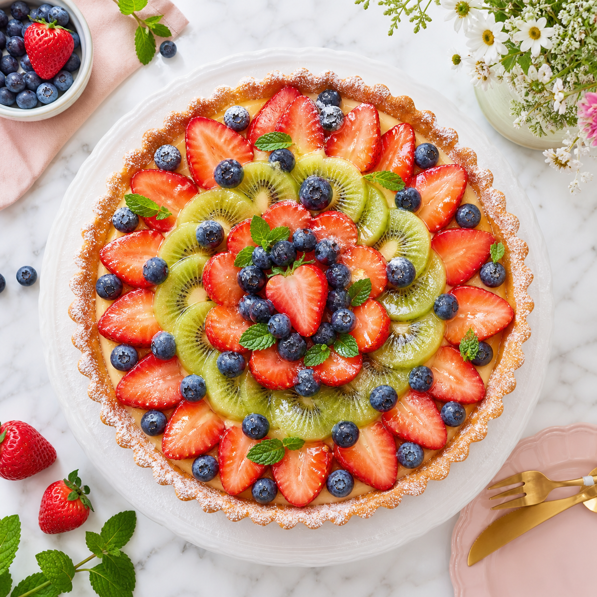

<div align="center">

# 🎨 codex-image

**Claude Code 안에서 `/codex-image` 한 줄로 이미지를 만든다.**
API 키도, SDK도, 브라우저도 없이 — Codex OAuth 하나면 끝.

[](LICENSE)
[](https://docs.anthropic.com/en/docs/claude-code)
[](https://platform.openai.com)
[-F59E0B.svg)](#핵심-oauth로-어떻게-키-없이-되나)

</div>

```bash
# 이 한 줄이면 gpt-image-2 가 그린 이미지가 폴더에 저장되고 화면에 바로 뜬다
/codex-image 벚꽃 흩날리는 한옥 마당, 늦은 오후의 황금빛
```

인증은 `codex login` 최초 1회로 끝. 이후엔 API 키를 발급할 일도, 어딘가 저장할 일도 없다.

---

## 이 스킬로 만든 이미지

<table>
<tr>
<td align="center" width="34%"><br><sub><b>음식</b> · <code>1024²</code> · high</sub></td>
<td align="center" width="33%"><br><sub><b>인테리어</b> · <code>1536×1024</code> · high</sub></td>
<td align="center" width="33%"><br><sub><b>일러스트</b> · <code>1024²</code> · high</sub></td>
</tr>
</table>

<sub>프롬프트 예시 · 음식: `밝은 자연광 아래 흰 대리석 위 과일 타르트 플랫레이` · 인테리어: `아침 햇살 가득한 북유럽 거실, 원목과 초록 화분` · 일러스트: `등대와 폭포가 있는 작은 부유 섬, 파스텔 아이소메트릭 3D`</sub>

> 전부 이 스킬로 생성. `codex exec` → 내장 `image_gen` → `gpt-image-2`, API 키 없이 OAuth만.

---

## 3분 셋업

```bash
npm install -g @openai/codex     # ① Codex CLI (이미지 생성 엔진)
codex login                      # ② ChatGPT 로 최초 1회 OAuth
codex login status               # ③ "Logged in ..." 확인

# ④ 스킬 설치 — 전역(모든 프로젝트)
git clone https://github.com/newrise0410/codex-image.git ~/.claude/skills/codex-image
#    또는 프로젝트 로컬
git clone https://github.com/newrise0410/codex-image.git .claude/skills/codex-image
```

설치 후 Claude Code 세션을 새로 시작하면 `/codex-image`를 쓸 수 있다.

---

## 사용법

```bash
/codex-image 흰 배경 위의 빨간 사과                                  # 기본
/codex-image --size 1024x1536 노을 지는 미래도시 스카이라인          # 세로형
/codex-image --quality high --out ./public/images 벚꽃 핀 한옥        # 고품질·경로지정
/codex-image -n 3 테크 스타트업 로고 변형                            # 여러 장
/codex-image --size 1536x1024 제주 해안선 항공샷                     # 가로형
```

| 플래그 | 값 | 기본값 | 설명 |
|--------|-----|--------|------|
| `--size` | `1024x1024` · `1024x1536` · `1536x1024` · `auto` | `1024x1024` | 이미지 크기 |
| `--quality` | `low` · `medium` · `high` · `auto` | `auto` | 생성 품질 |
| `--out` | 디렉터리 경로 | 프로젝트 루트 | 저장 위치 |
| `-n` | 1~10 | `1` | 생성 장수 |

**저장 규칙** — 덮어쓰기 방지를 위해 `타임스탬프 + 랜덤 접미사`로 저장하고 저장 직전 충돌 검사까지 한다.

```
codex-image-20260703-143052-9f3a.png       # 단일
codex-image-20260703-143052-9f3a-1.png     # 여러 장 중 첫 번째
```

---

## 핵심: OAuth로 어떻게 키 없이 되나

Codex OAuth 토큰은 `sk-...` API 키가 아니라 **세션 토큰**이라, OpenAI REST API에 직접 던지면 `401`로 막힌다. 대신 `codex exec`를 거치면 Codex가 내부에서 인증을 대신 처리한다.

| 방식 | 결과 | 메모 |
|------|:---:|------|
| `OPENAI_API_KEY` → REST API | ✅ | 표준. 단 키를 발급·관리해야 함 |
| OAuth 토큰 → REST API 직접 | ❌ `401` | 세션 토큰이라 REST가 거부 |
| OAuth 토큰 → `codex exec` → `image_gen` | ✅ | **codex-image가 쓰는 경로** |

```
codex login → ~/.codex/auth.json (OAuth 토큰)
   → codex exec 가 토큰 자동 로드
      → 내장 image_gen (gpt-image-2) 가 OAuth 인증
         → 이미지 생성 → 저장 검증 → 프로젝트로 복사 → 인라인 표시
```

---

## 프롬프트 팁

`배경/장면 → 주체 → 디테일 → 제약` 순으로 쌓으면 결과가 안정적이다.

- **조명 구체화**: `warm golden hour side light` > `good lighting`
- **카메라 언어**: `shallow depth of field`, `aerial view`, `macro close-up`
- **스타일 지정**: `photorealistic`, `concept art`, `3D render`, `flat illustration`
- **네거티브는 자연어로**: 전용 파라미터가 없으니 `without text, no watermark`처럼 프롬프트 안에 서술

---

## 문제 해결

| 증상 | 해결 |
|------|------|
| `NOT_FOUND` | `npm install -g @openai/codex` |
| 인증 만료 | `codex login` 재실행 |
| 사용량 한도 | 시간이 지나 리셋되면 재시도, 또는 플랜 확인 |
| Trust 에러 | 스킬이 `--skip-git-repo-check` 사용. 또는 `~/.codex/config.toml`에 신뢰 추가 |
| 타임아웃(>2분) | `--quality low` 또는 `-n` 축소 |
| REST API `401` | 정상 — OAuth는 REST 직접 호출 불가. `codex exec`가 처리 |

---

## 비용 · 보안

- **비용** — OAuth(ChatGPT 로그인) 경로라 과금·한도는 연결된 계정의 플랜과 Codex/ChatGPT 사용 정책을 따른다. 장당 고정 단가로 단정하지 않으며, 정확한 요금은 [OpenAI pricing](https://openai.com/api/pricing/)에서 확인한다.
- **별도 API 키 저장 안 함** — Codex가 관리하는 OAuth 토큰만 사용(`~/.codex/auth.json`).
- **스킬 자체 텔레메트리·추가 업로드 없음** — 생성 이미지는 지정 경로에만 저장.

> 이미지 생성 특성상 프롬프트·생성 요청은 Codex를 통해 OpenAI 서비스로 전송되고 결과도 그곳에서 내려받는다. "외부 통신이 전혀 없다"가 아니라, 이 스킬이 그 외 데이터를 따로 수집·전송하지 않는다는 의미다.

---

## 프로젝트 구조

```
codex-image/
├── SKILL.md          # Claude Code 스킬 정의 (/codex-image 동작)
├── README.md         # 이 문서
├── LICENSE           # MIT
├── .gitignore
└── examples/         # 이 스킬로 생성한 예시 이미지
    ├── food-tart.png            (1024x1024, high)
    ├── cozy-interior.png        (1536x1024, high)
    └── isometric-island.png     (1024x1024, high)
```

## 라이선스

MIT — [LICENSE](LICENSE) 참고.
